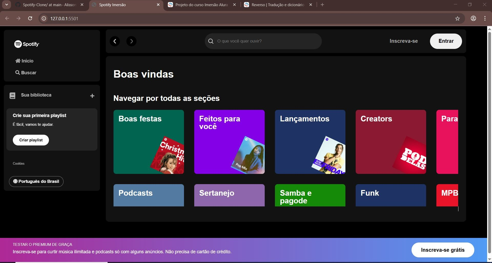

Immersão Alura front end, Spotify Clone .

The main features are: navigation , consumption of an API for artist name and image query and responsive layout, properties were consulted on the official website of Spotify .

Requirements :
Download the extension "Live server" in VS Code .

Start the project: 
npm i json-server -g
json-server - - watch api-artists/artists.json - - port 3000 
click on "go server" in the VS Code

Technologies used:
HTML, CSS and JavaScript
 

